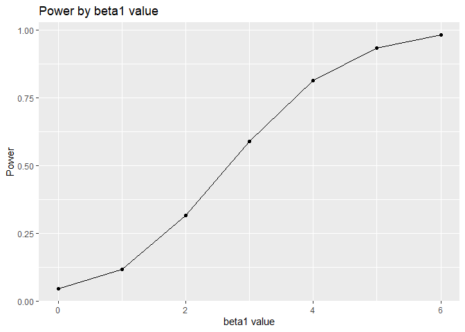
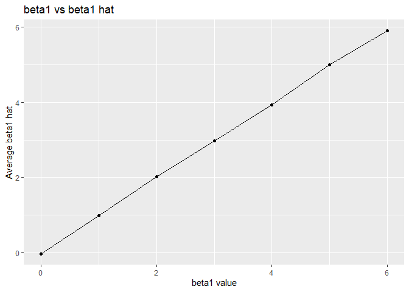
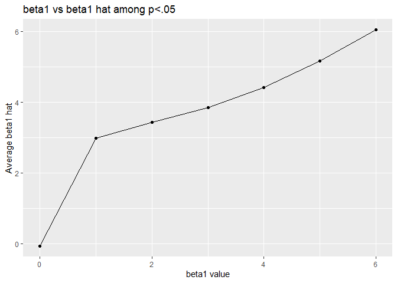

HW 5
================
Sam Loewen
11/3/2019

# Problem 1

``` r
set.seed(1)
fill_in_values = function(x){
 
  if(is.numeric(x) == T) {
    x[is.na(x)] = mean(x, na.rm=T)
    }
  if(is.character(x) == T){
    x[is.na(x)] = replace_na("virginica")
    }

  return(x)
 
}

iris_with_missing = map_df(iris_with_missing,fill_in_values)
```

# Problem 2

``` r
set.seed(1)
file_list = list.files("./data", pattern= "*.csv")

study_data = map_df(paste("./data", file_list, sep = "/"), read_csv) %>% 

  mutate(file_name = file_list) %>% 
  separate(file_name, c("study_arm", "study_id", "csv")) %>% 
  select(study_arm, study_id, week_1:week_8, -csv) %>% 
  mutate(study_arm = ifelse(study_arm == "con", "control", "experimental"),
         study_id = c(1:20))
```

    ## Parsed with column specification:
    ## cols(
    ##   week_1 = col_double(),
    ##   week_2 = col_double(),
    ##   week_3 = col_double(),
    ##   week_4 = col_double(),
    ##   week_5 = col_double(),
    ##   week_6 = col_double(),
    ##   week_7 = col_double(),
    ##   week_8 = col_double()
    ## )
    ## Parsed with column specification:
    ## cols(
    ##   week_1 = col_double(),
    ##   week_2 = col_double(),
    ##   week_3 = col_double(),
    ##   week_4 = col_double(),
    ##   week_5 = col_double(),
    ##   week_6 = col_double(),
    ##   week_7 = col_double(),
    ##   week_8 = col_double()
    ## )
    ## Parsed with column specification:
    ## cols(
    ##   week_1 = col_double(),
    ##   week_2 = col_double(),
    ##   week_3 = col_double(),
    ##   week_4 = col_double(),
    ##   week_5 = col_double(),
    ##   week_6 = col_double(),
    ##   week_7 = col_double(),
    ##   week_8 = col_double()
    ## )
    ## Parsed with column specification:
    ## cols(
    ##   week_1 = col_double(),
    ##   week_2 = col_double(),
    ##   week_3 = col_double(),
    ##   week_4 = col_double(),
    ##   week_5 = col_double(),
    ##   week_6 = col_double(),
    ##   week_7 = col_double(),
    ##   week_8 = col_double()
    ## )
    ## Parsed with column specification:
    ## cols(
    ##   week_1 = col_double(),
    ##   week_2 = col_double(),
    ##   week_3 = col_double(),
    ##   week_4 = col_double(),
    ##   week_5 = col_double(),
    ##   week_6 = col_double(),
    ##   week_7 = col_double(),
    ##   week_8 = col_double()
    ## )
    ## Parsed with column specification:
    ## cols(
    ##   week_1 = col_double(),
    ##   week_2 = col_double(),
    ##   week_3 = col_double(),
    ##   week_4 = col_double(),
    ##   week_5 = col_double(),
    ##   week_6 = col_double(),
    ##   week_7 = col_double(),
    ##   week_8 = col_double()
    ## )
    ## Parsed with column specification:
    ## cols(
    ##   week_1 = col_double(),
    ##   week_2 = col_double(),
    ##   week_3 = col_double(),
    ##   week_4 = col_double(),
    ##   week_5 = col_double(),
    ##   week_6 = col_double(),
    ##   week_7 = col_double(),
    ##   week_8 = col_double()
    ## )
    ## Parsed with column specification:
    ## cols(
    ##   week_1 = col_double(),
    ##   week_2 = col_double(),
    ##   week_3 = col_double(),
    ##   week_4 = col_double(),
    ##   week_5 = col_double(),
    ##   week_6 = col_double(),
    ##   week_7 = col_double(),
    ##   week_8 = col_double()
    ## )
    ## Parsed with column specification:
    ## cols(
    ##   week_1 = col_double(),
    ##   week_2 = col_double(),
    ##   week_3 = col_double(),
    ##   week_4 = col_double(),
    ##   week_5 = col_double(),
    ##   week_6 = col_double(),
    ##   week_7 = col_double(),
    ##   week_8 = col_double()
    ## )
    ## Parsed with column specification:
    ## cols(
    ##   week_1 = col_double(),
    ##   week_2 = col_double(),
    ##   week_3 = col_double(),
    ##   week_4 = col_double(),
    ##   week_5 = col_double(),
    ##   week_6 = col_double(),
    ##   week_7 = col_double(),
    ##   week_8 = col_double()
    ## )
    ## Parsed with column specification:
    ## cols(
    ##   week_1 = col_double(),
    ##   week_2 = col_double(),
    ##   week_3 = col_double(),
    ##   week_4 = col_double(),
    ##   week_5 = col_double(),
    ##   week_6 = col_double(),
    ##   week_7 = col_double(),
    ##   week_8 = col_double()
    ## )
    ## Parsed with column specification:
    ## cols(
    ##   week_1 = col_double(),
    ##   week_2 = col_double(),
    ##   week_3 = col_double(),
    ##   week_4 = col_double(),
    ##   week_5 = col_double(),
    ##   week_6 = col_double(),
    ##   week_7 = col_double(),
    ##   week_8 = col_double()
    ## )
    ## Parsed with column specification:
    ## cols(
    ##   week_1 = col_double(),
    ##   week_2 = col_double(),
    ##   week_3 = col_double(),
    ##   week_4 = col_double(),
    ##   week_5 = col_double(),
    ##   week_6 = col_double(),
    ##   week_7 = col_double(),
    ##   week_8 = col_double()
    ## )
    ## Parsed with column specification:
    ## cols(
    ##   week_1 = col_double(),
    ##   week_2 = col_double(),
    ##   week_3 = col_double(),
    ##   week_4 = col_double(),
    ##   week_5 = col_double(),
    ##   week_6 = col_double(),
    ##   week_7 = col_double(),
    ##   week_8 = col_double()
    ## )
    ## Parsed with column specification:
    ## cols(
    ##   week_1 = col_double(),
    ##   week_2 = col_double(),
    ##   week_3 = col_double(),
    ##   week_4 = col_double(),
    ##   week_5 = col_double(),
    ##   week_6 = col_double(),
    ##   week_7 = col_double(),
    ##   week_8 = col_double()
    ## )
    ## Parsed with column specification:
    ## cols(
    ##   week_1 = col_double(),
    ##   week_2 = col_double(),
    ##   week_3 = col_double(),
    ##   week_4 = col_double(),
    ##   week_5 = col_double(),
    ##   week_6 = col_double(),
    ##   week_7 = col_double(),
    ##   week_8 = col_double()
    ## )
    ## Parsed with column specification:
    ## cols(
    ##   week_1 = col_double(),
    ##   week_2 = col_double(),
    ##   week_3 = col_double(),
    ##   week_4 = col_double(),
    ##   week_5 = col_double(),
    ##   week_6 = col_double(),
    ##   week_7 = col_double(),
    ##   week_8 = col_double()
    ## )
    ## Parsed with column specification:
    ## cols(
    ##   week_1 = col_double(),
    ##   week_2 = col_double(),
    ##   week_3 = col_double(),
    ##   week_4 = col_double(),
    ##   week_5 = col_double(),
    ##   week_6 = col_double(),
    ##   week_7 = col_double(),
    ##   week_8 = col_double()
    ## )
    ## Parsed with column specification:
    ## cols(
    ##   week_1 = col_double(),
    ##   week_2 = col_double(),
    ##   week_3 = col_double(),
    ##   week_4 = col_double(),
    ##   week_5 = col_double(),
    ##   week_6 = col_double(),
    ##   week_7 = col_double(),
    ##   week_8 = col_double()
    ## )
    ## Parsed with column specification:
    ## cols(
    ##   week_1 = col_double(),
    ##   week_2 = col_double(),
    ##   week_3 = col_double(),
    ##   week_4 = col_double(),
    ##   week_5 = col_double(),
    ##   week_6 = col_double(),
    ##   week_7 = col_double(),
    ##   week_8 = col_double()
    ## )

``` r
study_data %>% 
  pivot_longer(week_1:week_8,
    names_to = "week",
    values_to = "obs")%>% 
  ggplot(aes(x=week, y=obs, group = study_id, color = study_arm)) + geom_point() + geom_line() +
  labs(title = "Observations over time, by study arm", 
    x = "week", 
    y = "observations")
```

<!-- -->

The control group consistantly had lower scores than the experimental
group. The experimental group seemed to score higher over time whereas
the control group stayed relatively level.

# Problem 3

``` r
set.seed(1)
p3_data = function(n=30, beta0=2, beta1) {
  
  sim_data = tibble(
    x = rnorm(n, 0, 1),
    y = beta0 + beta1 * x + rnorm(n, 0, sqrt(50))
  )
  
  ls_fit = lm(y ~ x, data = sim_data) %>% 
    broom::tidy()
  
  tibble(
    beta1_hat = ls_fit[[2,2]],
    beta1_p = ls_fit [[2,5]]
    
    )
}

sim_results = rerun(10000,p3_data(beta1 = 0)) %>% 
  bind_rows()

sim_results_all_b1 = 
  tibble(
    beta_1 = c(0, 1, 2, 3, 4, 5, 6)
  ) %>% 
  mutate(
    output_list = map(.x = beta_1, ~ rerun(10000, p3_data(beta1 = .x))),
    output_df = map(output_list, bind_rows)
  ) %>% 
  select(-output_list) %>% 
  unnest(output_df)
```

``` r
sim_results_all_b1 %>% 
  mutate(reject_null = ifelse(beta1_p<.05,1,0)) %>% 
  group_by(beta_1) %>% 
  summarize(power = mean(reject_null)) %>% 
  ggplot (aes(x=beta_1, y=power)) + geom_point() + geom_line() +
  labs(title = "Power by beta1 value", 
    x = "beta1 value", 
    y = "Power")
```

<!-- -->

Based on the plot, power increases as effect size increases.

``` r
sim_results_all_b1 %>% 
  group_by(beta_1) %>% 
  summarize(avg_b1 = mean(beta1_hat)) %>% 
  ggplot (aes(x=beta_1, y=avg_b1)) + geom_point() + geom_line() +
  labs(title = "beta1 vs beta1 hat", 
    x = "beta1 value", 
    y = "Average beta1 hat")
```

<!-- -->

``` r
sim_results_all_b1 %>% 
  mutate(reject_null = ifelse(beta1_p<.05,1,0)) %>% 
  filter(reject_null == 1) %>% 
  group_by(beta_1) %>% 
  summarize(avg_b1 = mean(beta1_hat)) %>% 
  ggplot (aes(x=beta_1, y=avg_b1)) + geom_point() + geom_line() +
  labs(title = "beta1 vs beta1 hat among p<.05", 
    x = "beta1 value", 
    y = "Average beta1 hat")
```

<!-- -->

In all cases, the sample average of β1 is appoximately equal to the true
value of β1. However when we filter for cases in which the null
hypothesis is rejected, the β1s are no longer equal.
