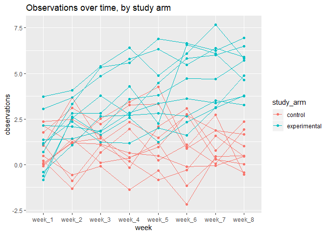
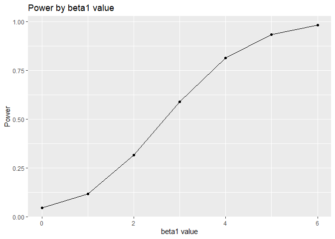
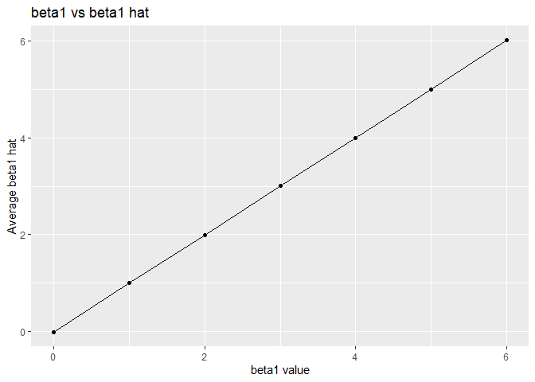
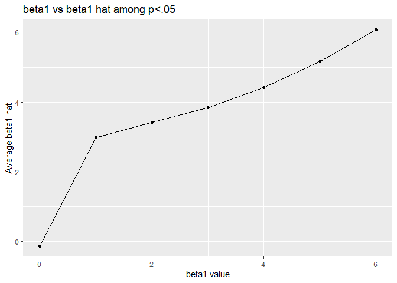

p8105\_hw5\_scl2160
================
Sam Loewen
11/3/2019

# Problem 1

``` r
set.seed(1)

iris_with_missing = iris %>% 
  map_df(~replace(.x, sample(1:150, 20), NA)) %>%
  mutate(Species = as.character(Species))
```

``` r
fill_in_values = function(x){
 
  if(is.numeric(x) == T) {
    x[is.na(x)] = mean(x, na.rm=T)
    }
  if(is.character(x) == T){
    x[is.na(x)] = replace_na("virginica")
    }

  return(x)
 
}

iris_with_no_missing = map_df(iris_with_missing, fill_in_values)
```

# Problem 2

``` r
set.seed(1)

file_list = list.files("./data", pattern= "*.csv")

study_data = map_df(paste("./data", file_list, sep = "/"), read_csv) %>% 
  mutate(file_name = file_list) %>% 
  separate(file_name, c("study_arm", "study_id", "csv")) %>% 
  select(study_arm, study_id, week_1:week_8, -csv) %>% 
  mutate(study_arm = ifelse(study_arm == "con", "control", "experimental"),
         study_id = c(1:20))
```

    ## Parsed with column specification:
    ## cols(
    ##   week_1 = col_double(),
    ##   week_2 = col_double(),
    ##   week_3 = col_double(),
    ##   week_4 = col_double(),
    ##   week_5 = col_double(),
    ##   week_6 = col_double(),
    ##   week_7 = col_double(),
    ##   week_8 = col_double()
    ## )
    ## Parsed with column specification:
    ## cols(
    ##   week_1 = col_double(),
    ##   week_2 = col_double(),
    ##   week_3 = col_double(),
    ##   week_4 = col_double(),
    ##   week_5 = col_double(),
    ##   week_6 = col_double(),
    ##   week_7 = col_double(),
    ##   week_8 = col_double()
    ## )
    ## Parsed with column specification:
    ## cols(
    ##   week_1 = col_double(),
    ##   week_2 = col_double(),
    ##   week_3 = col_double(),
    ##   week_4 = col_double(),
    ##   week_5 = col_double(),
    ##   week_6 = col_double(),
    ##   week_7 = col_double(),
    ##   week_8 = col_double()
    ## )
    ## Parsed with column specification:
    ## cols(
    ##   week_1 = col_double(),
    ##   week_2 = col_double(),
    ##   week_3 = col_double(),
    ##   week_4 = col_double(),
    ##   week_5 = col_double(),
    ##   week_6 = col_double(),
    ##   week_7 = col_double(),
    ##   week_8 = col_double()
    ## )
    ## Parsed with column specification:
    ## cols(
    ##   week_1 = col_double(),
    ##   week_2 = col_double(),
    ##   week_3 = col_double(),
    ##   week_4 = col_double(),
    ##   week_5 = col_double(),
    ##   week_6 = col_double(),
    ##   week_7 = col_double(),
    ##   week_8 = col_double()
    ## )
    ## Parsed with column specification:
    ## cols(
    ##   week_1 = col_double(),
    ##   week_2 = col_double(),
    ##   week_3 = col_double(),
    ##   week_4 = col_double(),
    ##   week_5 = col_double(),
    ##   week_6 = col_double(),
    ##   week_7 = col_double(),
    ##   week_8 = col_double()
    ## )
    ## Parsed with column specification:
    ## cols(
    ##   week_1 = col_double(),
    ##   week_2 = col_double(),
    ##   week_3 = col_double(),
    ##   week_4 = col_double(),
    ##   week_5 = col_double(),
    ##   week_6 = col_double(),
    ##   week_7 = col_double(),
    ##   week_8 = col_double()
    ## )
    ## Parsed with column specification:
    ## cols(
    ##   week_1 = col_double(),
    ##   week_2 = col_double(),
    ##   week_3 = col_double(),
    ##   week_4 = col_double(),
    ##   week_5 = col_double(),
    ##   week_6 = col_double(),
    ##   week_7 = col_double(),
    ##   week_8 = col_double()
    ## )
    ## Parsed with column specification:
    ## cols(
    ##   week_1 = col_double(),
    ##   week_2 = col_double(),
    ##   week_3 = col_double(),
    ##   week_4 = col_double(),
    ##   week_5 = col_double(),
    ##   week_6 = col_double(),
    ##   week_7 = col_double(),
    ##   week_8 = col_double()
    ## )
    ## Parsed with column specification:
    ## cols(
    ##   week_1 = col_double(),
    ##   week_2 = col_double(),
    ##   week_3 = col_double(),
    ##   week_4 = col_double(),
    ##   week_5 = col_double(),
    ##   week_6 = col_double(),
    ##   week_7 = col_double(),
    ##   week_8 = col_double()
    ## )
    ## Parsed with column specification:
    ## cols(
    ##   week_1 = col_double(),
    ##   week_2 = col_double(),
    ##   week_3 = col_double(),
    ##   week_4 = col_double(),
    ##   week_5 = col_double(),
    ##   week_6 = col_double(),
    ##   week_7 = col_double(),
    ##   week_8 = col_double()
    ## )
    ## Parsed with column specification:
    ## cols(
    ##   week_1 = col_double(),
    ##   week_2 = col_double(),
    ##   week_3 = col_double(),
    ##   week_4 = col_double(),
    ##   week_5 = col_double(),
    ##   week_6 = col_double(),
    ##   week_7 = col_double(),
    ##   week_8 = col_double()
    ## )
    ## Parsed with column specification:
    ## cols(
    ##   week_1 = col_double(),
    ##   week_2 = col_double(),
    ##   week_3 = col_double(),
    ##   week_4 = col_double(),
    ##   week_5 = col_double(),
    ##   week_6 = col_double(),
    ##   week_7 = col_double(),
    ##   week_8 = col_double()
    ## )
    ## Parsed with column specification:
    ## cols(
    ##   week_1 = col_double(),
    ##   week_2 = col_double(),
    ##   week_3 = col_double(),
    ##   week_4 = col_double(),
    ##   week_5 = col_double(),
    ##   week_6 = col_double(),
    ##   week_7 = col_double(),
    ##   week_8 = col_double()
    ## )
    ## Parsed with column specification:
    ## cols(
    ##   week_1 = col_double(),
    ##   week_2 = col_double(),
    ##   week_3 = col_double(),
    ##   week_4 = col_double(),
    ##   week_5 = col_double(),
    ##   week_6 = col_double(),
    ##   week_7 = col_double(),
    ##   week_8 = col_double()
    ## )
    ## Parsed with column specification:
    ## cols(
    ##   week_1 = col_double(),
    ##   week_2 = col_double(),
    ##   week_3 = col_double(),
    ##   week_4 = col_double(),
    ##   week_5 = col_double(),
    ##   week_6 = col_double(),
    ##   week_7 = col_double(),
    ##   week_8 = col_double()
    ## )
    ## Parsed with column specification:
    ## cols(
    ##   week_1 = col_double(),
    ##   week_2 = col_double(),
    ##   week_3 = col_double(),
    ##   week_4 = col_double(),
    ##   week_5 = col_double(),
    ##   week_6 = col_double(),
    ##   week_7 = col_double(),
    ##   week_8 = col_double()
    ## )
    ## Parsed with column specification:
    ## cols(
    ##   week_1 = col_double(),
    ##   week_2 = col_double(),
    ##   week_3 = col_double(),
    ##   week_4 = col_double(),
    ##   week_5 = col_double(),
    ##   week_6 = col_double(),
    ##   week_7 = col_double(),
    ##   week_8 = col_double()
    ## )
    ## Parsed with column specification:
    ## cols(
    ##   week_1 = col_double(),
    ##   week_2 = col_double(),
    ##   week_3 = col_double(),
    ##   week_4 = col_double(),
    ##   week_5 = col_double(),
    ##   week_6 = col_double(),
    ##   week_7 = col_double(),
    ##   week_8 = col_double()
    ## )
    ## Parsed with column specification:
    ## cols(
    ##   week_1 = col_double(),
    ##   week_2 = col_double(),
    ##   week_3 = col_double(),
    ##   week_4 = col_double(),
    ##   week_5 = col_double(),
    ##   week_6 = col_double(),
    ##   week_7 = col_double(),
    ##   week_8 = col_double()
    ## )

``` r
study_data
```

    ## # A tibble: 20 x 10
    ##    study_arm study_id week_1 week_2 week_3 week_4 week_5 week_6 week_7
    ##    <chr>        <int>  <dbl>  <dbl>  <dbl>  <dbl>  <dbl>  <dbl>  <dbl>
    ##  1 control          1   0.2  -1.31    0.66   1.96   0.23   1.09   0.05
    ##  2 control          2   1.13 -0.88    1.07   0.17  -0.83  -0.31   1.58
    ##  3 control          3   1.77  3.11    2.22   3.26   3.31   0.89   1.88
    ##  4 control          4   1.04  3.66    1.22   2.33   1.47   2.7    1.87
    ##  5 control          5   0.47 -0.580  -0.09  -1.37  -0.32  -2.17   0.45
    ##  6 control          6   2.37  2.5     1.59  -0.16   2.08   3.07   0.78
    ##  7 control          7   0.03  1.21    1.13   0.64   0.49  -0.12  -0.07
    ##  8 control          8  -0.08  1.42    0.09   0.36   1.18  -1.16   0.33
    ##  9 control          9   0.08  1.24    1.44   0.41   0.95   2.75   0.3 
    ## 10 control         10   2.14  1.15    2.52   3.44   4.26   0.97   2.73
    ## 11 experime~       11   3.05  3.67    4.84   5.8    6.33   5.46   6.38
    ## 12 experime~       12  -0.84  2.63    1.64   2.58   1.24   2.32   3.11
    ## 13 experime~       13   2.15  2.08    1.82   2.84   3.36   3.61   3.37
    ## 14 experime~       14  -0.62  2.54    3.78   2.73   4.49   5.82   6   
    ## 15 experime~       15   0.7   3.33    5.34   5.57   6.9    6.66   6.24
    ## 16 experime~       16   3.73  4.08    5.4    6.41   4.87   6.09   7.66
    ## 17 experime~       17   1.18  2.35    1.23   1.17   2.02   1.61   3.13
    ## 18 experime~       18   1.37  1.43    1.84   3.6    3.8    4.72   4.68
    ## 19 experime~       19  -0.4   1.08    2.66   2.7    2.8    2.64   3.51
    ## 20 experime~       20   1.09  2.8     2.8    4.3    2.25   6.57   6.09
    ## # ... with 1 more variable: week_8 <dbl>

``` r
study_data %>% 
  pivot_longer(week_1:week_8,
    names_to = "week",
    values_to = "obs")%>% 
  ggplot(aes(x=week, y=obs, group = study_id, color = study_arm)) + geom_point() + geom_line() +
  labs(title = "Observations over time, by study arm", 
    x = "week", 
    y = "observations")
```

<!-- -->

The control group consistantly had lower scores than the experimental
group. The experimental group seemed to score higher over time, whereas
the control group stayed relatively level.

# Problem 3

``` r
set.seed(1)
p3_data = function(n=30, beta0=2, beta1) {
  
  sim_data = tibble(
    x = rnorm(n, 0, 1),
    y = beta0 + beta1 * x + rnorm(n, 0, sqrt(50))
  )
  
  ls_fit = lm(y ~ x, data = sim_data) %>% 
    broom::tidy()
  
  tibble(
    beta1_hat = ls_fit[[2,2]],
    beta1_p = ls_fit [[2,5]]
    
    )
}

sim_results = rerun(10000,p3_data(beta1 = 0)) %>% 
  bind_rows()

sim_results_all_b1 = 
  tibble(beta_1 = c(0, 1, 2, 3, 4, 5, 6)) %>% 
  mutate(
    output_list = map(.x = beta_1, ~ rerun(10000, p3_data(beta1 = .x))),
    output_df = map(output_list, bind_rows)) %>% 
  select(-output_list) %>% 
  unnest(output_df)
```

``` r
sim_results_all_b1 %>% 
  mutate(reject_null = ifelse(beta1_p<.05,1,0)) %>% 
  group_by(beta_1) %>% 
  summarize(power = mean(reject_null)) %>% 
  ggplot (aes(x = beta_1, y = power)) + geom_point() + geom_line() +
  labs(title = "Power by beta1 value", 
    x = "beta1 value", 
    y = "Power")
```

<!-- -->

Power increases as effect size increases.

``` r
sim_results_all_b1 %>% 
  group_by(beta_1) %>% 
  summarize(avg_b1_hat = mean(beta1_hat)) %>% 
  ggplot (aes(x = beta_1, y = avg_b1_hat)) + geom_point() + geom_line() +
  labs(title = "beta1 vs beta1 hat", 
    x = "beta1 value", 
    y = "Average beta1 hat")
```

<!-- -->

``` r
sim_results_all_b1 %>% 
  mutate(reject_null = ifelse(beta1_p<.05,1,0)) %>% 
  filter(reject_null == 1) %>% 
  group_by(beta_1) %>% 
  summarize(avg_b1_hat = mean(beta1_hat)) %>% 
  ggplot (aes(x=beta_1, y=avg_b1_hat)) + geom_point() + geom_line() +
  labs(title = "beta1 vs beta1 hat among p<.05", 
    x = "beta1 value", 
    y = "Average beta1 hat") 
```

<!-- -->

When we look at all cases, the sample average of β1 is appoximately
equal to the true value of β1. However when we filter for cases in which
the null hypothesis is rejected, the β1s are no longer equal. Our
estiamted and true values are less similar in the second plot because we
are filtering for cases where we would reject the null hypothesis, or
cases where our outcome is significantly different from our expected
value.
